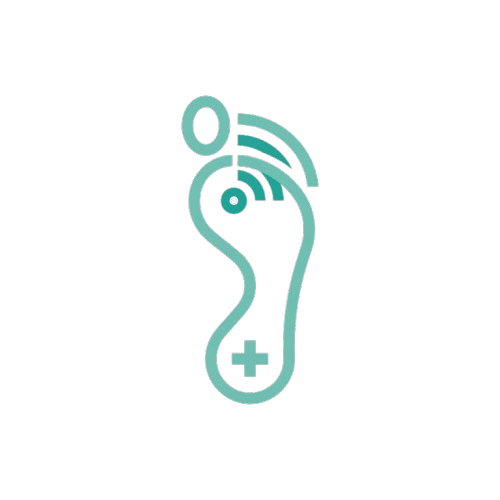
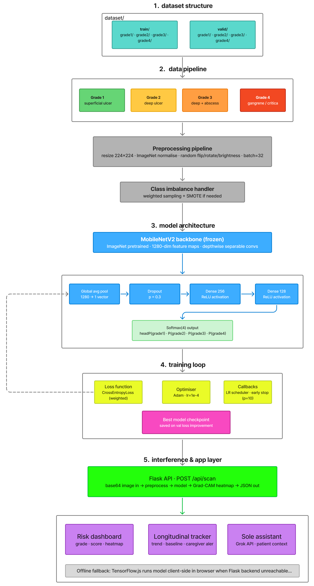
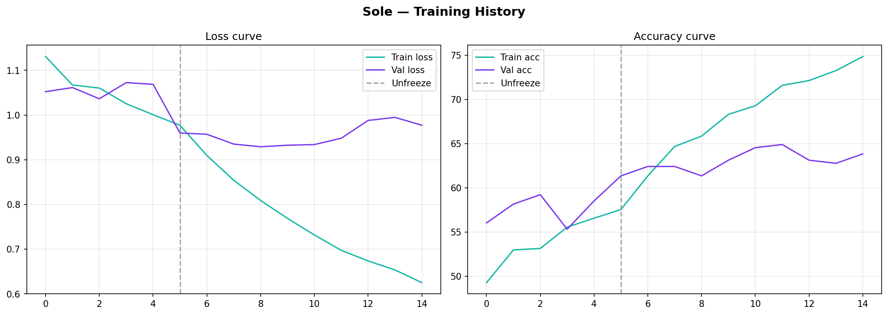
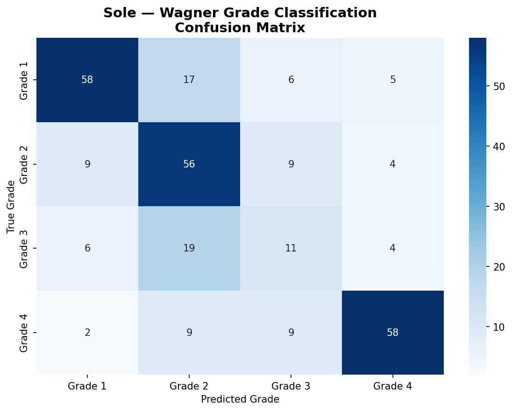
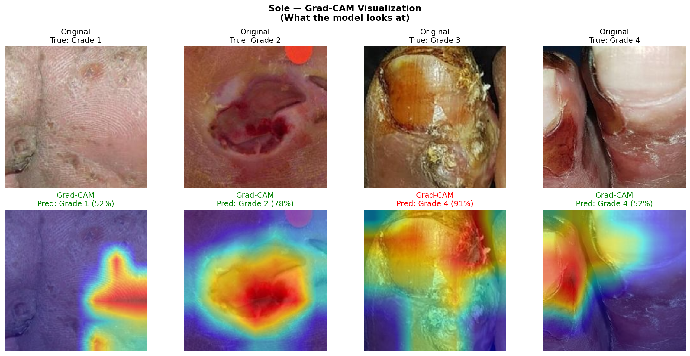

# Sole — Know before it shows

Sole is a computer vision-based foot health monitoring system designed to identify early signs of diabetic foot ulcers. The system combines a lightweight deep learning model with a user-facing web interface to provide risk scores, visual heatmaps, and actionable insights for patients and clinicians.

## Motivation

Diabetic foot complications are among the leading causes of non-traumatic lower limb amputations worldwide. Early detection is critical—most ulcerations develop silently over months, and timely intervention can prevent progression to infection and amputation. Sole enables continuous, accessible monitoring using only a smartphone camera, empowering patients to detect changes before they become severe.

---

## Overview

The system analyzes images of the plantar surface of the foot and predicts ulcer severity across four Wagner grades. For each scan, it generates:

* An overall risk score (0–100)
* Zone-wise risk distribution (heel, ball, arch, toe)
* A visual Grad-CAM heatmap highlighting high-risk regions
* Trend analysis relative to baseline measurements
* Contextual recommendations from an AI assistant

The application is designed to be accessible, requiring only a standard smartphone camera and no specialized hardware.

---

## System Architecture

The system consists of three main components:

1. **Model Training Pipeline**: A convolutional neural network based on MobileNetV2, trained on a labeled dataset of plantar images categorized into four Wagner severity grades. The model is optimized for mobile deployment without sacrificing accuracy.

2. **Backend (Flask REST API)**: Handles image preprocessing, model inference, and response generation. Manages patient data, scan history, caregiver alerts, and contextual responses from the AI assistant. Provides clinician-facing endpoints for patient monitoring and risk stratification.

3. **Frontend (React + Vite)**: Mobile-first web interface built with React 18, TailwindCSS, and Recharts. Enables patient self-monitoring, daily health tracking, scan history visualization, and caregiver communication. Clinician dashboard for patient risk management.



---

## Model Details

### Architecture

* **Backbone**: MobileNetV2 (ImageNet pretrained weights)
* **Input Size**: 224 × 224 pixels (RGB)
* **Output**: 4-class classification (Wagner Grade 1–4)
* **Head**:
  * Global average pooling
  * Dense layers (256 → 128 units)
  * Dropout (0.3)
  * Softmax output layer

### Training Configuration

* **Loss Function**: Weighted CrossEntropyLoss (addresses class imbalance)
* **Optimizer**: Adam with learning rate 1e-4
* **Data Augmentation**:
  * Random rotation (10–20 degrees)
  * Horizontal flip
  * Brightness adjustments (0.8–1.2)
  * Gaussian blur and contrast normalization
* **Class Imbalance Handling**: Weighted sampling and SMOTE for minority classes

### Model Performance

The model was evaluated on a held-out test set using standard metrics:





Key metrics:
* Overall accuracy on test set
* Weighted F1-score accounting for class imbalance
* Per-grade sensitivity and specificity

---

## Inference Pipeline
mage-to-risk-score pipeline follows these steps:

1. **Input Reception**: Image received as base64-encoded JPEG or PNG upload
2. **Preprocessing**: Resize to 224×224, normalize using ImageNet statistics
3. **Model Inference**: Forward pass through MobileNetV2 backbone to obtain class probabilities
4. **Heatmap Generation**: Grad-CAM applied to final convolutional layer to highlight discriminative regions
5. **Risk Scoring**: Probabilities mapped to numerical risk scores per zone (heel, ball, arch, toe)
6. **Trend Analysis**: Compared against patient's baseline to detect deterioration or improvement
7. **Response Generation**: JSON response includes predictions, heatmap, zones, trend indicators, and contextual recommendations



---

## API Endpoints

### Patient Endpoints

**POST `/api/scan`**
Processes a foot image and returns prediction results.

Response includes:
* overall_risk (0–100 scale)
* grade (1–4 Wagner classification)
* grade_label (Grade 1, Grade 2, etc.)
* zone_scores (heel, ball, arch, toe per-zone risks)
* heatmap_b64 (Base64-encoded Grad-CAM visualization)
* probabilities (raw model outputs)
* timestamp

**POST `/api/checkin`**
Stores daily patient vitals and symptoms.

Captured data:
* blood_sugar (mg/dL)
* steps (activity level)
* sleep_hours
* pain_level (1–10)
* symptoms (comma-separated list)

**GET `/api/patient/{patient_id}`**
Retrieves patient profile and current risk status.

**GET `/api/scan/{patient_id}`**
Retrieves scan history for trend visualization.

**POST `/api/chat`**
Sends a message to the AI assistant; returns contextual response.

Powered by Claude API with context from recent scans and vitals.

### Clinician Endpoints

**GET `/api/clinic/patients`**
Lists all enrolled patients sorted by current risk score.

**GET `/api/clinic/patient/{patient_id}`**
Detailed patient view with scan history, trends, and alert logs.

**POST `/api/clinic/caregiver`**
Registers a caregiver for alert notifications.
Technical Stack

### Backend
* **Framework**: Flask 3.0.3 with Flask-CORS
* **Database**: SQLite with SQLAlchemy ORM
* **ML Inference**: PyTorch (MobileNetV2) with Pillow for image preprocessing
* **AI Integration**: Anthropic Claude API for conversational assistant
* **Deployment**: Docker containerization, WSGI-compatible for production hosting

### Frontend
* **Framework**: React 18 with TypeScript
* **Build Tool**: Vite for development and production builds
* **Styling**: TailwindCSS with custom medical design tokens
* **Charts**: Recharts for trend visualization
* **UI Components**: Radix UI primitives with custom styling
* **HTTP Client**: Fetch API with typed endpoint layers
* **Localization**: Support for English and Hindi

### Development Tools
* **Testing**: Vitest for unit tests, React Testing Library for component tests
* **Linting**: ESLint with TypeScript support
* **Form Handling**: React Hook Form with Zod validation

---

## Installation and Running

### Prerequisites
* Python 3.9 or later
* Node.js 18 or later
* SQLite3 (included with Python)

### Backend Setup

```bash
cd backend
python3 -m venv venv
source venv/bin/activate  # On Windows: venv\Scripts\activate
pip install -r requirements.txt
cp .env.example .env
# Edit .env with your API keys
flask init-db
flask seed-demo  # Load demo patient data
python app.py
```

Backend will run on `http://localhost:5000`

### Frontend Setup

```bash
cd frontend
npm install
npm run dev
```

Frontend will run on `http://localhost:5175`

The frontend is configured to proxy API requests to the Flask backend at `http://localhost:5000`

---

## Model Training

To train the model on a custom dataset:

```bash
cd backend
python train.py --dataset-path /path/to/dataset --epochs 50 --batch-size 32
```

Dataset directory structure:
```
dataset/
  train/
    grade1/      # ~40% of images
    grade2/      # ~30% of images
    grade3/      # ~20% of images
    grade4/      # ~10% of images
  val/
    grade1/
    grade2/
    grade3/
    grade4/
```

Trained checkpoint will be saved as `sole_best.pth`. Update the MODEL_PATH environment variable to use the new model for inference.

---

## Environment Configuration

Create a `.env` file in the backend directory with the following variables:

```
FLASK_ENV=development
ANTHROPIC_API_KEY=your_api_key_here
CLINICIAN_PASSWORD=secure_password
MODEL_PATH=./sole_best.pth
DATABASE_URL=sqlite:///sole.db
```

---

## Database Schema

The system uses SQLAlchemy ORM with the following core models:

* **Patient**: Demographic data, contact information, enrollment status
* **Scan**: Individual foot image analyses with predictions and heatmaps
* **CheckIn**: Daily vitals and symptom tracking
* **Baseline**: Reference measurements for each patient (initialized at enrollment)
* **Caregiver**: Family members or clinicians with alert permissions
* **AlertLog**: Audit trail of all threshold exceedances and notifications

---

## Clinical Considerations

### Limitations

* The model is trained on a limited dataset and may not generalize across all skin tones, lighting conditions, or foot deformities.
* Image-based predictions are approximations and do not replace clinical examination or pressure-sensing equipment.
* Risk scores are calibrated for screening only and are not suitable for diagnosis.
* The system is designed to complement, not replace, professional medical judgment.

### Intended Use

Sole is positioned as an early warning and continuous monitoring tool for patients with diabetes. It is not a diagnostic device and predictions should not be used in isolation for clinical decision-making. Users should consult healthcare providers if high-risk indicators are observed.

### Data Privacy

Patient scan images and personal health information are stored locally in the SQLite database. For production deployment, implement:
* End-to-end encryption for data at rest
* HTTPS/TLS for data in transit
* Role-based access control (RBAC) in the clinician interface
* HIPAA-compliant audit logging
* Secure authentication (OAuth2, multi-factor authentication)
    grade3/
    grade4/
```

---

## Limitations

* The model is trained on a limited dataset and may not generalize across all skin tones, lighting conditions, or foot deformities.
* Predictions are not clinically validated and should not be used for diagnosis.
* Camera-based inference is an approximation and does not replace pressure-sensing hardware.

---

## Future Work

* Clinical validation with real-world patient data
* Improved dataset diversity and size
* Better calibration of risk scores
* On-device inference optimization (TensorFlow.js)
* Integration with healthcare providers

---
## Architecture Diagram


---
## Notes

Sole is intended as an early warning and monitoring tool. It is not a diagnostic system. Users are encouraged to consult medical professionals if high-risk indicators are observed.

